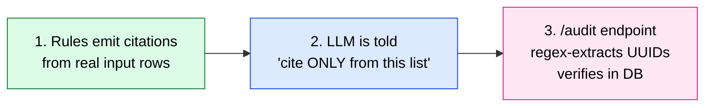
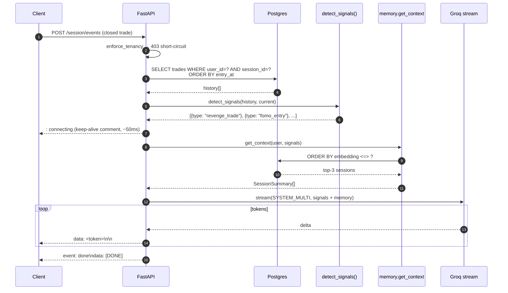

# Architecture

A self-contained reference for how the NevUp AI Engine is wired together. Reading this end-to-end should leave you able to predict, for any request, which modules execute and in what order.

## Components at a glance

```mermaid
flowchart TB
    Client([Client]) -->|JWT-HS256| MW[TracingMiddleware<br/>traceId · structured logs · /metrics]
    MW --> Auth{require_user<br/>+ enforce_tenancy<br/>403 not 404}
    Auth -->|sub != userId| Client

    Auth --> MR["/memory/*"]
    Auth --> PR["/profile/{userId}"]
    Auth --> CR["/session/events"]
    Auth --> AR["/audit"]

    MR --> MS[memory.service]
    MS -->|embed| EMB[embed chain<br/>Gemini → fastembed → SHA]
    MS --> PG[(Postgres + pgvector<br/>session_summaries)]

    PR --> RULES[profiling.rules<br/>9 deterministic scorers<br/>tunable THRESHOLDS]
    PR --> LLM[profiling.llm<br/>Gemini JSON narrate<br/>rules-only fallback]
    RULES --> PG
    LLM -.fallback.-> RULES

    CR --> SIG[detect_signals<br/>list[dict] of active signals]
    SIG --> INT[intervention.stream_coaching<br/>SYSTEM_SINGLE | SYSTEM_MULTI]
    INT --> MS
    INT --> GROQ[Groq stream<br/>Llama 3.3 70B<br/>SSE tokens]

    AR --> RX[regex extract UUID]
    RX --> PG

    classDef rules fill:#dcfce7,stroke:#15803d,color:#000
    classDef storage fill:#dbeafe,stroke:#1d4ed8,color:#000
    classDef llm fill:#fed7aa,stroke:#c2410c,color:#000
    classDef external fill:#fef3c7,stroke:#a16207,color:#000

    class RULES rules
    class PG storage
    class GROQ llm
    class EMB,LLM external
```

## Three-layer anti-hallucination architecture



| Layer | Module | Guarantee |
|---|---|---|
| 1 | [`app/profiling/rules.py`](../app/profiling/rules.py) | Every citation is `t["trade_id"]` / `t["session_id"]` from the input list. No hardcoded UUIDs anywhere. |
| 2 | [`app/profiling/llm.py`](../app/profiling/llm.py) | System prompt: *"Citations MUST be drawn from the evidence array provided. Never invent IDs."* JSON mode. After parse, `parsed["userId"] = user_id`. |
| 3 | [`app/audit/router.py`](../app/audit/router.py) | Regex-extracts every UUID from any text, validates `WHERE user_id = sub AND session_id IN (...)`. |

## Coaching SSE flow (sub-400ms first byte target)



## Embedding fallback chain

```mermaid
flowchart LR
    Q[embed(text)] --> T1{Gemini key set?}
    T1 -->|yes| G1[Gemini 768d]
    T1 -->|no| F2
    G1 -->|fail after retry| F2[fastembed 384d]
    F2 -->|fail| F3[SHA pseudo-embedding]
    G1 --> OK([return vector])
    F2 -.zero-pad to 768.- OK
    F3 --> OK

    classDef tier1 fill:#dcfce7,stroke:#15803d,color:#000
    classDef tier2 fill:#dbeafe,stroke:#1d4ed8,color:#000
    classDef tier3 fill:#fce7f3,stroke:#db2777,color:#000

    class G1 tier1
    class F2 tier2
    class F3 tier3
```

Each tier increments `embedding_fallback_total{tier=...}` so `/metrics` shows the production split.

## Persistence guarantees

| Data | Where | Surives container restart? |
|---|---|---|
| Session summaries + embeddings | `session_summaries` table on `dbdata` named volume | ✅ |
| Raw trades | `trades` table | ✅ (loaded from seed JSON on every boot via `entrypoint.sh`) |
| In-process metrics | `requests_total`, `request_latency_ms`, `embedding_fallback_total` | ❌ — resets on restart. Acceptable; ops scrapes via `/metrics` before restart if needed. |

## Auth + tenancy

| Aspect | Implementation |
|---|---|
| Algorithm | HS256 with shared secret (PyJWT) |
| Required claims | `exp`, `iat`, `sub`, `role` (enforced via `options={"require": [...]}`) |
| Role check | `role == "trader"` else 401 |
| Tenancy | `enforce_tenancy(user, requested_user_id, request)` — single shared dependency on every userId-bound route, returns 403 with `traceId` (NOT 404) |

## Test surfaces

- **Unit (no DB)** — `pytest -m "not integration"` — 51 tests including TDD-shaped scorers, JWT, fixtures, eval harness, threshold tuner.
- **Integration (real Postgres + pgvector)** — full pytest run — 64 tests including end-to-end `/profile`, `/audit`, `/memory`, `/session/events` SSE, multi-label eval.
- **Persistence (opt-in)** — `RUN_PERSISTENCE_TEST=1 pytest tests/test_persistence.py` — boots compose, writes a summary, restarts, retrieves. 1 test.
- **Load** — `loadtest/k6_run.sh` — 30 VUs / 60s, asserts SSE first-byte and success rate.

## Why this shape (not another)

| Choice | Why | Tradeoff |
|---|---|---|
| pgvector in same container as relational data | Single source of truth, atomic transactions, no cross-service consistency | Doesn't scale past ~100k vectors per index |
| Rules-first / LLM-second | Citations *cannot* be hallucinated by construction | Coverage capped by what hand-written rules can express; v0.3 work toward learned classifier |
| Three-tier embedding chain | Resilient to Gemini outage, no single point of failure | 384→768 zero-pad is a kludge; v0.3 column migration |
| In-process metrics | Zero deps, sub-µs overhead | Doesn't aggregate across multiple uvicorn workers; OK at our scale |
| HS256 JWT (not RS256) | Brief specifies HS256 with shared demo secret | Production would want RS256 + KMS-managed keypair |
